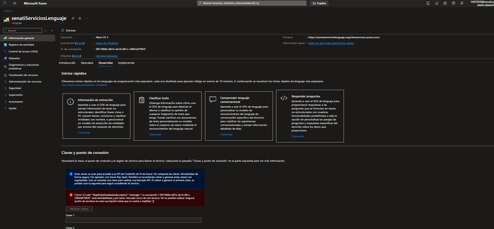
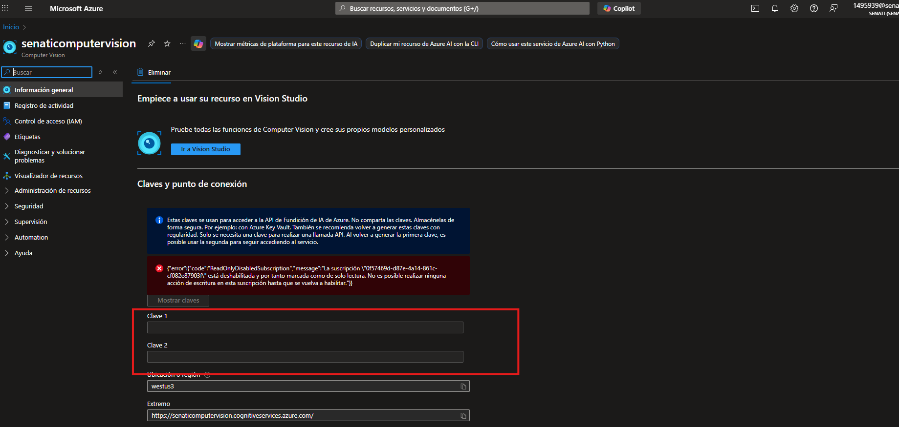
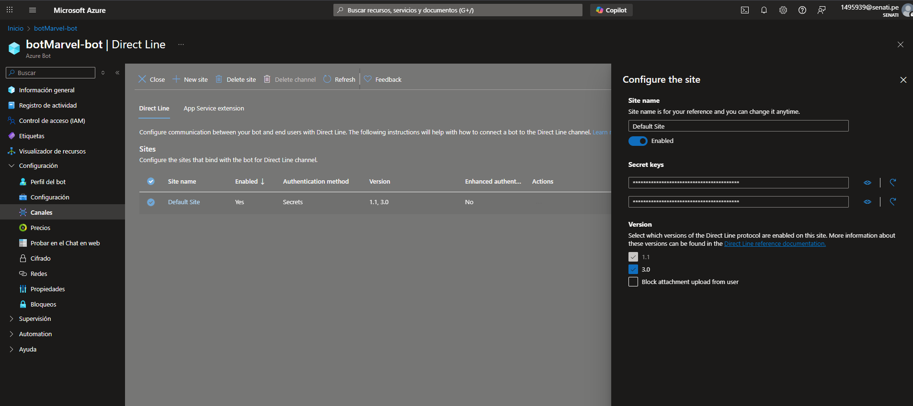

# 🚀 Servicios de Azure con Inteligencia Artificial - Node.js

Aplicación desarrollada con **Node.js**, **Express** y **EJS** que consume tres servicios de Azure Cognitive Services:

-   🧠 **Análisis de sentimientos**
    
-   👁️ **Visión computacional (OCR)**
    
-   🤖 **Chatbot Marvel (Bot Framework)**
    

----------

## ⚙️ Características principales

-   Análisis de texto con **Azure Language Service (Sentiment Analysis)**
    
-   Lectura de texto desde imágenes con **Azure Computer Vision (OCR)**
    
-   Chatbot integrado mediante **Azure Bot Service y Direct Line API**
    
-   Interfaz limpia con **EJS y Bootstrap**
    

----------

## 🧩 Requisitos previos

Antes de comenzar asegúrate de tener instalado:

-   **Node.js** v18 o superior
    
-   **npm** (incluido con Node.js)
    
-   **Cuenta activa en [Azure Portal](https://portal.azure.com)**
    
-   **Recursos creados en Azure**:
    
    -   ✅ _Language Service (Sentiment Analysis)_
        
    -   ✅ _Computer Vision Service_
        
    -   ✅ _Bot Channels Registration (para el chatbot)_
        

----------

## 📦 Instalación

1.  **Clona el repositorio**
 ```
git clone https://github.com/DanteLuque/serviciosAzureIANode.git
cd danteluque-serviciosazureianode
```
2.  **Instala las dependencias**
 ```
npm install
```
3. Crea tu archivo `.env` basado en `.env.example`
```
# SERVER
PORT=3000

# AZURE ANALISIS DE SENTIMIENTOS
API_KEY_SENTIMIENTOS=tu_clave_language_service

# AZURE COMPUTER VISION
API_KEY_COMPUTER_VISION=tu_clave_computer_vision

# AZURE CHATBOT MARVEL (Direct Line Secret)
API_KEY_DIRECT_LINE_CHATBOT=tu_clave_direct_line_secret
```
## 🔑 Cómo obtener las claves desde Azure

### 🧠 1. Language Service (Análisis de sentimientos)

1.  En el [Portal de Azure](https://portal.azure.com), busca tu recurso **Language Service**.
    
2.  Ve a **Keys and Endpoint**.
    
3.  Copia una de las claves (`KEY 1` o `KEY 2`) y pégala en `API_KEY_SENTIMIENTOS`.
    
4.  Anota también el _endpoint base_ (ejemplo:  
    `https://tuserviciolenguaje.cognitiveservices.azure.com/`).


### 👁️ 2. Computer Vision

1.  Abre tu recurso de **Computer Vision**.
    
2.  Ve a **Keys and Endpoint**.
    
3.  Copia una de las claves y pégala en `API_KEY_COMPUTER_VISION`.
    
4.  Usa el _endpoint_ similar a:  
    `https://tuserviciovision.cognitiveservices.azure.com/`.


### 🤖 3. Chatbot (Bot Framework)

1.  Ve a tu recurso **Bot Channels Registration**.
    
2.  En el panel izquierdo, selecciona **Channels → Direct Line**.
    
3.  Activa Direct Line y copia el **Direct Line Secret** (no el token del iframe).
    
4.  Pega esa clave en `API_KEY_DIRECT_LINE_CHATBOT`.


## ▶️ Ejecución del proyecto

### En modo desarrollo (con recarga automática)
```
npm run dev
```
### En modo producción
```
npm start
```
La aplicación se iniciará en:
**[http://localhost:3000](http://localhost:3000)**

## 🧭 Rutas principales

| Servicio | URL | Descripción |
|-----------|-----|-------------|
| 🏠 **Inicio** | `/` | Página principal con accesos a todos los servicios |
| 💬 **Análisis de Sentimientos** | `/sentimientos` | Analiza texto y detecta emociones |
| 👁️ **Visión Computacional** | `/vision` | Extrae texto desde imágenes usando OCR |
| 🤖 **Chatbot Marvel** | `/chat` | Interactúa con el bot de Marvel integrado |

## 📁 Estructura del proyecto
```
danteluque-serviciosazureianode/
├── app.js
├── .env.example
├── package.json
├── src/
│   ├── apis/                 # Conexión a servicios de Azure
│   ├── controllers/          # Lógica de negocio
│   ├── routes/               # Rutas Express
│   └── views/                # Plantillas EJS (interfaz)
└── .github/workflows/        # CI/CD para despliegue en Azure
```
## ☁️ Despliegue en Azure

Este proyecto incluye un workflow de GitHub Actions para desplegar automáticamente en Azure App Service.

1.  Configura los secretos en tu repositorio (`AZUREAPPSERVICE_CLIENTID`, `TENANTID`, `SUBSCRIPTIONID`).
    
2.  Haz **push a la rama `main`**.
    
3.  GitHub Actions ejecutará el pipeline y desplegará la app.

## 📝Contribución

Si deseas contribuir a este proyecto, por favor:

1.  Haz un fork del repositorio
2.  Crea una rama para tu nueva funcionalidad (`git checkout -b feature/amazing-feature`)
3.  Realiza tus cambios
4.  Haz commit de tus cambios (`git commit -m 'Añadir nueva funcionalidad'`)
5.  Sube tus cambios (`git push origin feature/amazing-feature`)
6.  Abre un Pull Request
